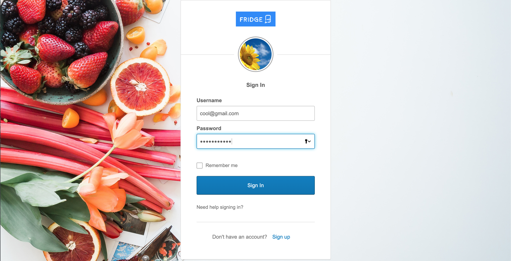
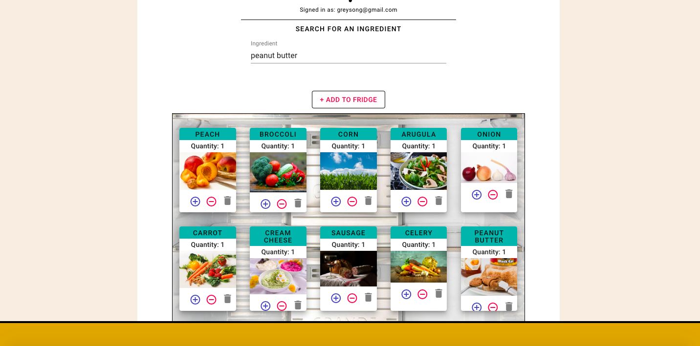
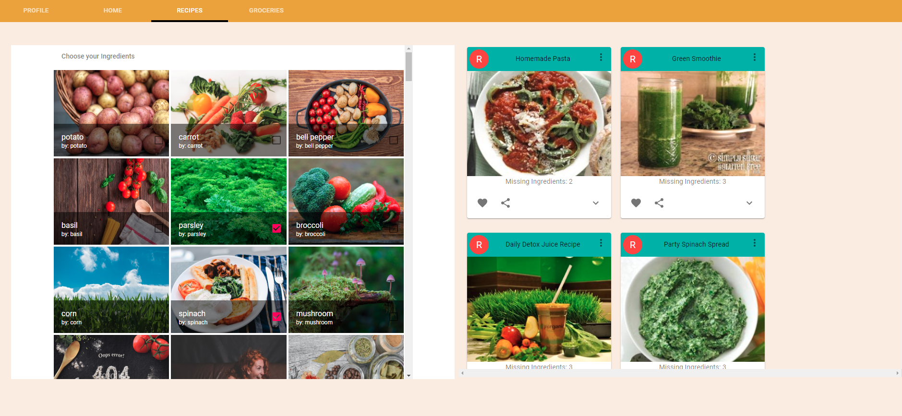
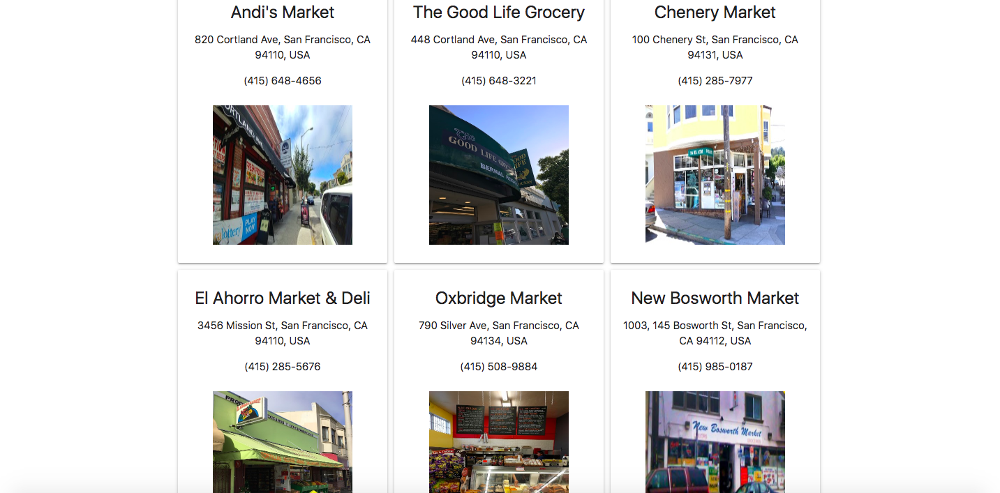

# Fridge

[Check out the deployed version!](https://fathomless-ocean-69359.herokuapp.com/)

As young adults, we spend hundreds of dollars eating out when we could 
easily make food with the ingredients at home.

### Our Site

 

FRIDGE allows users to:

    - Store and keep track of the ingredients in their fridge 
    - Search for recipes based on the ingredients in the fridge 
    - Look for nearby grocery stores to purchase the missing ingredients needed 
      for the recipe

 

## To run locally 

    - Clone Repo
    - In the porject repository terminal: 
        - npm install
        - node server.js 
        - npm run client 
    - Run `mongod` in the background

### Contributors

######

| Author | Github  | Linkedin
| --------------- | --------- | -----------
| Megha Prasad | https://github.com/meghabprasad | https://www.linkedin.com/in/megha-bindiganavale/
| Greyson Gerhard-Young | https://github.com/greysongy | https://www.linkedin.com/in/greyson-gerhard-young/ 
| Christopher Celestino | https://github.com/BAANG) | https://www.linkedin.com/in/christopher-celestino/
| Matthew Ryan Haggarty | https://github.com/matthewryanhagarty |  https://www.linkedin.com/in/matthewryanhagarty/

######

### Tech Used

1. [JavaScript](https://www.javascript.com/)

2. [Node](https://nodejs.org/en/)

- Node.js is an open-source, cross-platform JavaScript run-time environment that executes JavaScript code outside of a browser. 
- Node.js lets developers use JavaScript to write command line tools and for server-side scripting—running scripts server-side to produce dynamic web page content before the page is sent to the user's web browser

3. [MongoDB](https://www.mongodb.com/)

- MongoDB is a general purpose, document-based, distributed database built for modern application developers and for the cloud era. 

4. [Mongoose](https://mongoosejs.com)

- Mongoose provides a straight-forward, schema-based solution to model your application data. It includes built-in type casting, validation, query building, business logic hooks and more, out of the box.

5. [Express](https://expressjs.com/)

- Express is a web application framework for Node.js, released as free and open-source software under the MIT License. It is designed for building web applications and APIs and is the standard server framework for Node.js

6. [React](https://reactjs.org)
- React is a component based library that makes it painless to create interactive UIs. Design simple views for each state in your application, and React will efficiently update and render just the right components when your data changes.

7. [Okta](https://www.okta.com/)

- A user authentication service that allows developers to build identity controls into applications, website web services and  devices.

8. [Material UI](https://material-ui.com)
- Material Design is a popular React UI framework that makes for faster and easier web development. Material UI uses more grid-based layouts, responsive animations and transitions, padding, and depth effects such as lighting and shadows.

9. [Spoonacular API](https://spoonacular.com/food-api)
- Spoonacular provides simple queries to retrieve relevant recipes, along with associated info (like images and original URLs). For our application, the most relevant feature was being able to query based on a list of ingredients (in your fridge) that you'd like to include in a recipe, and then get responses with the msising ingredients. 

10. [Google Maps API](https://developers.google.com/maps/documentation/javascript/tutorial)
- An easily embedabble APi that helps find a current user's location, and can subsequently embed a visual to help them find nearby grocery stores. This feature is currently being converted to React. 

11. [Google Places API](https://developers.google.com/places/web-service/intro)
- API to retrieve details/images about nearby locations. Queries can be filtered by type, and sorted by distance.

12. [Postmates API](https://postmates.com/developer)
- Feature under development, but is currently functioning in test mode. Designed so that users can directly order ingredients they're missing for a particular recipe.

# How it Works

## User Login

User creates an account on the signup page and inputs name, email, password 

User is then redirected to answer security questions and then to back to the profile page!

## Adding Ingredients to Your Fridge

User starts typing ingredient into the search bar and an autosuggest dropdown is displayed with all the ingredients containing the letters in the search bar.

After selecting the ingredient from the dropdown, users can add item to the fridge

## Searching for Recipes by Ingredients

User checks off the boxes of the ingredients they'd like to include in a recipe, then clicks find recipes. 

For every recipe, the user can click on the downward arrow to view missing ingredients. 

They can also click on the link button to get hte original source of the recipe (with detailed instructions).

## Finding Nearby Grocery Stores

When the user clicks on the grocery tab, they're redirected to a page that will ask them for their location. 

If they allow the sharing of their location, the visual map creates a marker to show them where they are. 

A list of the 20 nearest grocery stores simultaneously populates on the page (with additional contact info provided).

